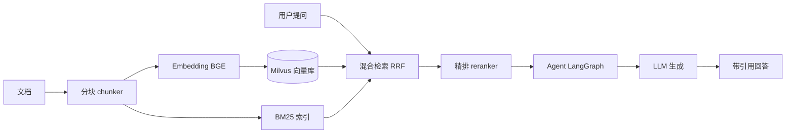

# 架构设计

## 总体架构

## 索引链路

1. `chunker` 把文档切成带重叠的块（默认 512 字 / 64 重叠）。
2. `embedder` 用 BGE 把每块编码成向量。
3. 向量存入 Milvus，同时用 `rank_bm25` 建稀疏索引。

## 检索链路

1. 问题同样编码成向量。
2. 稠密检索（Milvus 余弦相似度）+ 稀疏检索（BM25）分别取 top-k。
3. `RRF` 融合两路排序，无需手动调权重。
4. `reranker` 对候选精排，取最终 top-k。

## 关键设计决策

| 决策 | 选择 | 理由 |
|------|------|------|
| Agent 框架 | LangGraph | 状态图显式建模「检索→判断→工具→生成→反思」，可观测、可测试，比黑盒链式更工程化 |
| 向量库 | Milvus（Lite 起步） | 生产级国产方案，Lite 本地文件零部署，后期可平滑切 standalone/cloud |
| 混合检索 | BM25 + 向量 + RRF | 稀疏精确 + 稠密语义互补；RRF 免调参、鲁棒 |
| Embedding | BGE（bge-m3） | 中文多语言效果第一梯队，支持稠密+稀疏双表征 |
| 精排 | bge-reranker-v2-m3 | 粗召回后精排是性价比最高的精度提升 |
| 后端 | FastAPI | 异步、类型友好，Flask 经验可迁移 |

## 后续演进（P2–P4）

- P2：LangGraph 状态图加入 `grade` 节点（判断检索是否足够）与 `tools` 节点（联网搜索、计算器）。
- P3：`memory/` 加长期记忆（用户偏好、历史问答）；`mcp/` 用 FastMCP 把检索能力暴露成 MCP 工具。
- P4：`eval/` 做检索命中率 + 回答忠实度，并跑「纯 RAG vs RAG+Agent」对比。
